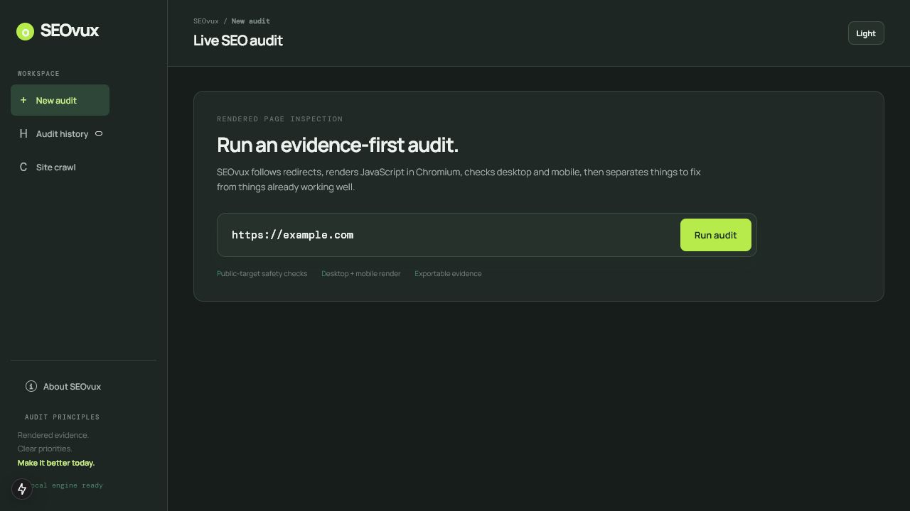
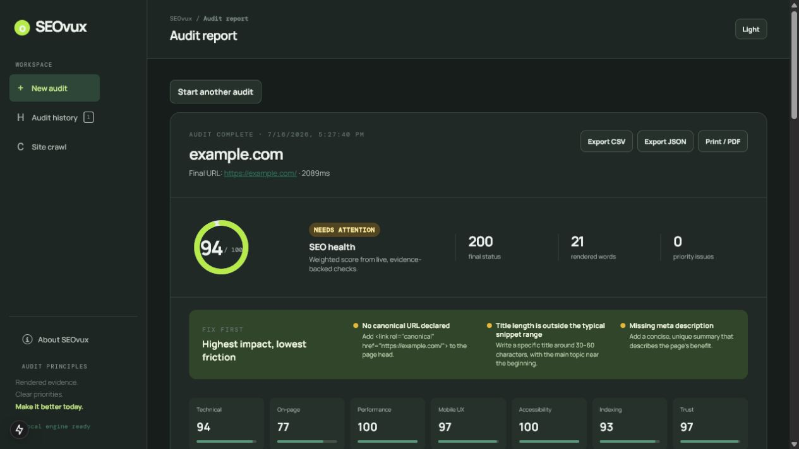
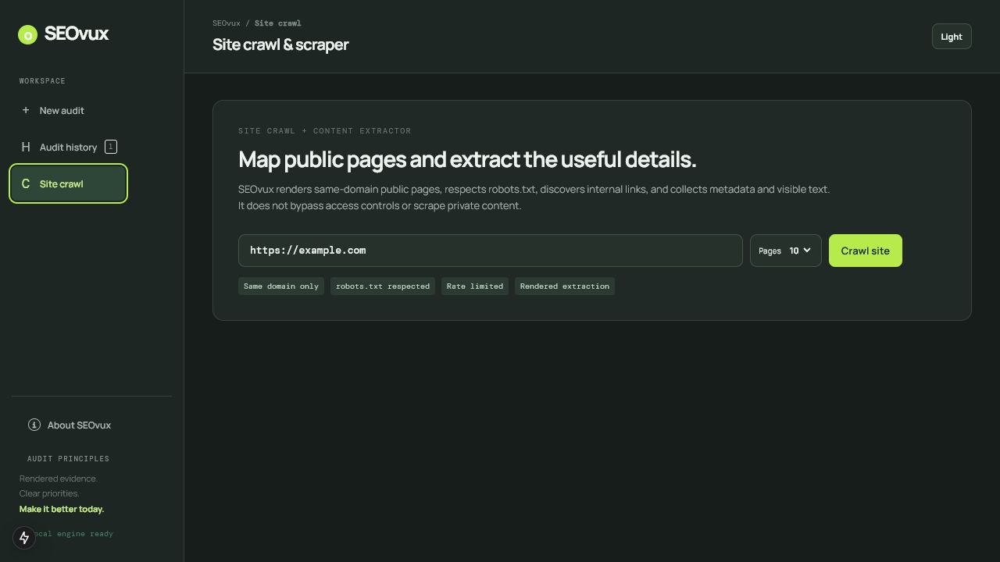

# SEOvux







SEOvux is a native Windows desktop SEO auditing tool. It loads public URLs in Chromium, analyzes the rendered page rather than only raw HTML, and reports evidence-backed issues alongside healthy signals.

> SEOvux helps identify technical and content signals. It does **not** guarantee Google rankings, indexing, traffic, revenue, or any business result.

## Features

### Live SEO audit

- Validates and normalizes public HTTP/HTTPS URLs with SSRF protection.
- Follows redirect chains and records status codes, target URLs, and redirect types.
- Renders the final page in Chromium on desktop and mobile viewports.
- Captures screenshots, rendered word count, metadata, and raw HTML versus rendered-DOM differences.
- Checks technical SEO, on-page SEO, indexing, mobile UX, accessibility, performance signals, Open Graph, JSON-LD, security headers, and mixed content.
- Explains every finding with severity, evidence, why it matters, a specific fix, and a verification step. Passed checks are shown too.

### Site Crawl and public content extraction

- Crawls 5, 10, 15, 20, or 30 same-domain public HTML pages.
- Reads and respects `robots.txt`, applies rate limiting, and does not follow crawl redirects to other domains.
- Records status, redirects, title, description, H1, canonical, robots directives, visible text, links, images, and word count.
- Flags broken pages, robots-blocked pages, indexability concerns, and duplicate titles, descriptions, and H1s.
- Exports crawl results as CSV or JSON and lets you inspect each extracted page.

SEOvux does not bypass logins, CAPTCHAs, paywalls, bot protection, or other access controls. Only audit or crawl websites that you own or are authorized to access.

## Install on Windows

1. Open [GitHub Releases](https://github.com/noxian0/SEOvux/releases).
2. Download `SEOvux-Setup-<version>.exe` from the latest release.
3. Run the installer and open SEOvux from the desktop or Start Menu shortcut.

After installation, use **About SEOvux → Check for updates** (or the SEOvux application menu) to check the official GitHub Releases page. When a newer version is available, SEOvux downloads it and updates the existing installation after you choose **Restart and install**. You do not need to uninstall first.

The installer includes the local audit engine, Node runtime, and the Chromium browser needed for live rendering. It does not require a separate Node.js or browser installation. Its size is expected because it contains a real browser engine for JavaScript-heavy websites.

## Privacy, safety, and limits

- The audit engine runs locally on your computer.
- Audit history is stored locally in the application browser storage.
- Website requests go directly from your computer to the target website; this desktop release does not require a cloud account, hosted database, or Redis.
- Private IP ranges, localhost, cloud metadata endpoints, unsafe protocols, and URLs containing credentials are rejected.
- Timeouts and blocked checks are reported clearly; SEOvux does not invent data.
- Crawl results can be incomplete when a site blocks automation, requires a login, changes during the crawl, or cannot be rendered.

## Exports

- Single-page audit: CSV, JSON, and Print/PDF.
- Site Crawl: CSV and JSON.
- Audit history: up to 20 recent completed audits on the local device.

## Development

### Requirements

- Windows 10 or 11 (x64) for the packaged desktop app.
- A current Node.js LTS release, npm, and an internet connection for source development.

### Run from source

```powershell
npm install
npx playwright install chromium
npm run dev
```

Open `http://localhost:3000` while developing.

### Test and build

```powershell
npm test
npm run build
```

### Build the Windows installer

```powershell
npm install
npx playwright install chromium
npm run package:desktop
```

The installer is written to `dist/SEOvux-Setup-<version>.exe`.

## Repository and releases

- Repository: [github.com/noxian0/SEOvux](https://github.com/noxian0/SEOvux)
- Release notes: [CHANGELOG.md](CHANGELOG.md)
- Publish a GitHub Release whose tag matches the version in `package.json` (for example, `v0.1.0`).
- To enable installation and in-app updates, upload these generated files without renaming them: `SEOvux-Setup-<version>.exe`, `SEOvux-Setup-<version>.exe.blockmap`, and `latest.yml`.

## License and terms

SEOvux is proprietary software for personal, private, non-commercial use. By downloading, installing, copying, or using it, you agree to the [SEOvux Custom License](LICENSE.md) and [Terms of Use](TERMS.md).

SEOvux includes third-party software that remains owned and licensed by its respective owners. See [LICENSE.md](LICENSE.md) for the third-party notice and use restrictions.
